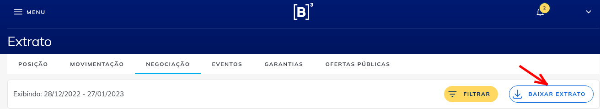
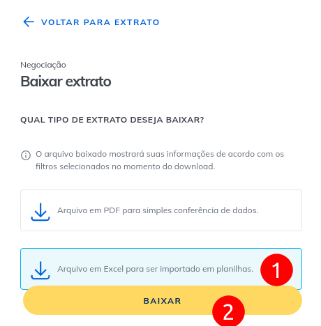

# ir - Projeto de calculo de Imposto de Renda em operacoes na bovespa automaticamente

## o que se propoe a fazer
 - Automaticamente busca todos as suas operacoes na bolsa no site do canal eletronico do investidor (CEI) (https://cei.b3.com.br/)
 - Apos buscar os trades no CEI, salva tudo em um arquivo csv no dropbox da sua conta
 - Todo dia 5 de cada mes executa e calcula (**automaticamente**):
    - Preco medio de compra
    - Preco medio de venda
    - Lucro/Prejuizo no mes
    - IR a pagar, ja considerando o possivel prejuizo acumulado
    - Tabela com a custodia atual para conferencia
    - Envia email com todas as informacoes para voce pagar o imposto
 - A ideia é ser TUDO automatico, mas ainda ter a opcao de voce manualmente ter controle de tudo via um arquivo csv caso algum papel sofra desdobramento ou mude o ticker de negociacao
 - Funciona com FIIs, ETFs, Acoes e Opcoes. Em desenvolvimento (FIP, FIPIE, Futuros)
 - Funciona com qualquer corretora. (Na verdade, nao depende da corretora)
 - Como alternativa a busca automática no CEI, é possível exportar as negociações manualmente para Excel (XSLX) e importar na aplicação

## o que voce vai precisar
 - Uma conta no CEI (https://cei.b3.com.br/)
 - Uma conta no dropbox com API habilitada (https://blogs.dropbox.com/developers/2014/05/generate-an-access-token-for-your-own-account/)
 - Configurar as variaveis de ambiente conforme (https://github.com/guilhermecgs/ir/blob/master/tests/test_environment_variables.py)
 - Voce pode executar tudo localmente e ver os resultados. Se quiser envio por email (SMTP), recomendo usar o https://elasticemail.com/ gratuitamente
 - Executar os comandos abaixo:
    - python ./ir.py --do check_environment_variables
    - python ./ir.py --do busca_trades_e_faz_merge_operacoes
    - python ./ir.py --do calculo_ir
    - python ./ir.py --do importar_negociacoes

   
## exemplo do relatorio gerado no seu email
https://github.com/guilhermecgs/ir/blob/master/exemplo_relatorio_automatico.pdf

## Exemplo de variáveis de ambiente:

 - DROPBOX_FILE_LOCATION:/Finance/GCGS/export_operacoes_gcgs.txt
 - DROPBOX_API_KEY:jOznaw_xxxxxxxxxxxxxxxxxxxxtkw9ox_a9I_8-_aU2xw1xxxxxxxxxxKWek69Z
 - SEND_TO:emaildestinatario@gmail.com
 - CPF:00098765434
 - SENHA_CEI:minha_senha_cei
 - SMTP_USER=meu_smtp_user@sss.com
 - SMTP_PASSWORD=passkkk
 - SMTP_SERVER=smtp.elasticemail.com
 - SMTP_PORT=2525

Além da definição das configurações do sistema via variáveis de ambiente, também é possível utilizar um arquivo de configuração `.env`:
```
DROPBOX_FILE_LOCATION=/Finance/GCGS/export_operacoes_gcgs.txt
DROPBOX_API_KEY=jOznaw_xxxxxxxxxxxxxxxxxxxxtkw9ox_a9I_8-_aU2xw1xxxxxxxxxxKWek69Z
```
Variáveis não definidas assumem os valores padrões definidos no arquivo `config.py`. Sendo que as únicas variáveis obrigatórias são: `DROPBOX_FILE_LOCATION` e `DROPBOX_API_KEY`.

## Exemplo de importação manual de negociações

1. Exporte as negociações do site da bovespa acessando https://www.investidor.b3.com.br/extrato/negociacao



2. Copie o arquivo exportado para pasta `importar`
3. Execute o comando para importar os arquivos: `python ./ir.py --do importar_negociacoes`
4. Remova os arquivos da pasta `importar`

## disclaimer
 - Aceito PRs :-)   Eu fiz o software pensando em automatizar exatamente como eu fazia as coisas manualmente
 - Nao funciona com daytrade e aluguel de acoes/fii
 - Desconsidera custos e emolumentos para simplificação do calculo!


# To do list
    - Incluir desconto de taxas, emolumentos e dedo duro - http://www.b3.com.br/pt_br/produtos-e-servicos/tarifas/listados-a-vista-e-derivativos/renda-variavel/tarifas-de-acoes-e-fundos-de-investimento/a-vista/
    - Incluir opcao completa ou so ultimos x meses
   
# techstack
    - python
    - selenium
    - gitlab ci
    - beautifulsoap
    - pandas
    
# Exemplos de Ajustes manuais
Na maioria das vezes, nenhuma intervenção manual é necessária. 
Apenas algumas situaçoes (listadas abaixo) será preciso alterar alguma coisa no csv de dados de forma pontual.
Geralmente só acrescentando uma linha a mais com a compra/venda já resolve. 
- Subscricao de titulos (nao existe essa informacao no cei; é necessário acrescentar uma linha com dos dados da compra)
- Venda de direitos subscricao
- IPOs
- Mudança no ticker de negociacao
- Desdobramento do ticker 
- Na primeira execução, é intessante bater a custódia calculada com o que aparece na sua corretora
   
    
# tags
canal eletronico do investidor, CEI, selenium, bovespa, IRPF, IR, imposto de renda, finance, yahoo finance, acao, fii, 
etf, python, crawler, webscraping, calculadora ir


# (algumas) fontes para consulta utilizadas 
- https://br.advfn.com/investimentos/futuros/imposto-de-renda
- https://www.arenadopavini.com.br/acoes-na-arena/receita-permite-compensar-perdas-de-etf-com-ganhos-de-acoes